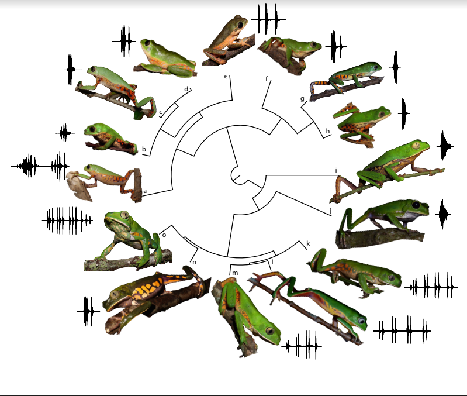

# ms_variability_anuran_call

__Data and Code for the article:__ 

__Variability in anuran advertisement call: A multi-level study with 15 species of monkey tree frogs (Anura: Phyllomedusidae)__

_David L. Röhr, Felipe Camurugi, Gustavo B. Paterno, Marcelo Gehara, Flora A. Juncá,
Guilherme F. R. Álvares, Reuber A. Brandão, and Adrian A. Garda_

***

1. To acess the raw data, see [raw_data]().

2. To access the source code for the analysis, see 
[source code]().

***

When using the __data available__ in this repository, please cite the original publication.  

Contact David L. Röhr (davidlucasr@yahoo.com.br) for any further information.  
